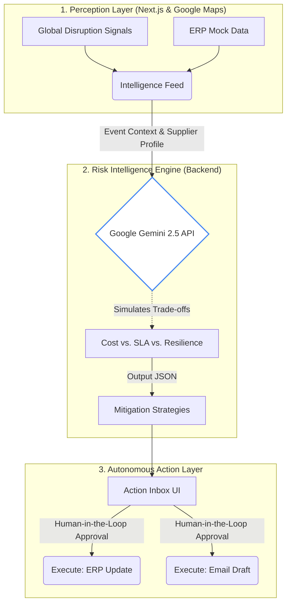

# SupplySense: Autonomous Supply Chain Resilience Agent

SupplySense is an intelligent operations Co-Pilot designed specifically for the **Tier-2 Automotive Parts (EV Components) industry**. It autonomously monitors supply chain disruptions, evaluates operational risks, simulates trade-offs, and proposes actionable mitigations using Google AI capabilities (Gemini).

## The Challenge

Global supply chains are entering a new era of structural volatility. Red Sea shipping disruptions, semiconductor shortages, and climate-driven logistics failures have made supply instability a persistent operational reality. 

Tier-2 EV manufacturers are vulnerable. They lack enterprise control towers but face strict OEM delivery Service Level Agreements (SLAs). Current dashboards are reactive, forcing operations teams into manual, high-stakes decisions under extreme uncertainty.

## The Solution

SupplySense acts as a virtual Co-Pilot that:
1. **Perceives:** Monitors global disruptions affecting specific critical EV components.
2. **Reasons:** Uses Google Gemini to simulate trade-offs between freight costs, OEM SLA penalties, and network resilience.
## Architecture



## Tech Stack
- **Frontend Layer:** Next.js (App Router), React, Global CSS (glassmorphic dark theme).
- **Intelligence Layer:** Google Gen AI SDK (`@google/genai`) powered by Gemini 2.5 Flash.
- **Data/Action Layer:** Mock supply chain data referencing real-world scenarios (e.g., Taiwan semiconductor yields, Red Sea closures).

## Running the Prototype Locally

1. **Install Dependencies:**
   ```bash
   npm install
   ```

2. **Configure Environment:**
   Create a `.env.local` file in the root directory and add your Gemini API key:
   ```env
   GEMINI_API_KEY=your_google_gemini_api_key_here
   ```

3. **Start the Dev Server:**
   ```bash
   npm run dev
   ```

4. **View the Dashboard:**
   Open [http://localhost:3000](http://localhost:3000) in your browser.

## Hackathon Pitch Materials

To view the pitch materials accompanying this repository:
- `pitch_deck_outline.md`: The 9-slide PowerPoint structure and Go-To-Market strategy.
- `pitch_video_script.md`: The 10-minute presentation and live demo script.

## Deployment

Please refer to [DEPLOYMENT.md](./DEPLOYMENT.md) for instructions on hosting SupplySense on Google Cloud Run.
